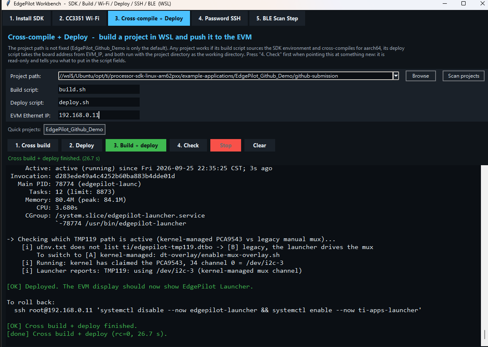

# EdgePilot Launcher for AM62P

Qt 6 kiosk launcher for the Texas Instruments AM62P-SK EVM. The application
replaces the TI Apps Launcher with a touchscreen-oriented EdgePilot interface
for system status, BLE temperature workflows, Earth-Moon 3D visualization,
and device diagnostics.

This repository is a source project. It does not redistribute the TI Processor
SDK, Qt runtime, vendor SDKs, or prebuilt release binaries.



## Demos

Recorded on an AM62P-SK EVM.

| Video | What it shows |
| --- | --- |
| [TMP119 temperature over I2C](https://youtu.be/FVcPc4rPJxg) | Reading the TMP119 behind the PCA9543 I2C mux, and the SoC thermal zones, live in the launcher |
| [BLE pairing with an Apollo510B](https://youtube.com/shorts/pJUpLRMOmOk) | Six-digit numeric-comparison pairing, then streaming the Health Thermometer characteristic |
| [Earth-Moon scene](https://youtu.be/Ad4Uxpe-re8) | The Qt Quick 3D mission visualization on the PowerVR GPU |

## Highlights

- Qt Quick and Qt Quick 3D UI running on Wayland/Weston
- AM62P system monitoring: CPU, GPU, memory, thermal, network, and storage
- BLE Scan workflow backed by `bluetoothctl`
- Earth-Moon mission visualization using Qt Quick 3D and the Qt RHI
- Cross-compilation and deployment scripts for an AM62P EVM
- A workbench GUI in `tools/` that drives install, build, deploy and board
  diagnostics from one window

## Target Platform

| Component | Target |
| --- | --- |
| Board | TI AM62P-SK EVM |
| OS | Processor SDK Linux |
| Window system | Wayland / Weston |
| Target Qt | Qt 6 supplied by the EVM sysroot |
| Rendering | Qt Quick Scene Graph / Qt RHI, OpenGL ES backend |
| Service | `edgepilot-launcher.service` |

## Architecture

```text
AM62P EVM
  systemd
    └── edgepilot-launcher
          ├── C++ backends
          │     ├── SystemMonitor
          │     ├── BenchmarkRunner
          │     ├── BleScanner
          │     └── UiSyncServer
          └── QML UI
                ├── Main.qml and navigation rail
                ├── pages/
                ├── earth3d/
                └── assets/

```

The Earth 3D page is a QML-only Qt Quick 3D scene. Qt Quick uses the Qt 6
scene graph and RHI; the current EVM configuration selects the OpenGL ES RHI
backend. See [docs/ARCHITECTURE.md](docs/ARCHITECTURE.md) for the detailed
rendering and runtime boundaries.

## Source Layout

| Path | Purpose |
| --- | --- |
| `main.cpp` | Qt application entry point and backend registration |
| `src/` | C++ hardware, BLE, benchmark, and UI-sync backends |
| `qml/` | Shared QML interface used by the EVM and simulator |
| `qml/pages/` | Launcher pages and workflow screens |
| `qml/earth3d/` | Earth, Moon, mission, trajectory, and vehicle components |
| `assets/` | UI, brand, Earth, Moon, and icon resources |
| `tools/` | Workbench GUI and host setup scripts |
| `evm-assets/` | Optional first-boot EVM helper assets |
| `docs/` | WSL setup, hardware, deployment, and troubleshooting notes |
| `build.sh` | Clean AM62P cross-build |
| `deploy.sh` | EVM binary and service deployment |
| `CMakeLists.txt` / `qml.qrc` | Build definition and Qt resources |

## Build and Deploy

Prerequisites:

- WSL2 Ubuntu with the TI Processor SDK Linux for AM62P
- Qt host tools compatible with the target Qt headers
- An EVM reachable by SSH as `root`

```bash
cd /opt/ti/processor-sdk-linux-am62pxx/example-applications/EdgePilot_Github_Demo
source /opt/ti/processor-sdk-linux-am62pxx/linux-devkit/environment-setup
./build.sh
EVM_IP=192.xxx.xx.xx ./deploy.sh
```

The build script removes and recreates `build/`, so generated products are not
part of the source layout. See [cmake/TOOLCHAIN.md](cmake/TOOLCHAIN.md),
[docs/03-cross-compilation.md](docs/03-cross-compilation.md) and
[docs/15-qt-deployment.md](docs/15-qt-deployment.md) for setup details.

The complete host and EVM setup notes are indexed in
[docs/README.md](docs/README.md).

`tools/EdgePilot_Workbench.pyw` drives the whole loop — install the SDK,
cross-compile, deploy, and probe the board — from one window; see
[tools/README.md](tools/README.md).

## Licensing

Project-owned source and documentation are released under the BSD 3-Clause
License. See [LICENSE](LICENSE). Files and assets carrying another notice keep
their original terms. Dependencies are not relicensed by this repository; see
[THIRD_PARTY_NOTICES.md](THIRD_PARTY_NOTICES.md).

The provenance and processing boundary for project images is recorded in
[ASSET_PROVENANCE.md](ASSET_PROVENANCE.md).

## Status

This is an engineering and demonstration project for AM62P hardware. Hardware
features depend on the installed Processor SDK image, connected peripherals,
and board configuration. The Earth-Moon animation is a deterministic visual
mission sequence, not a physics or navigation simulator.
